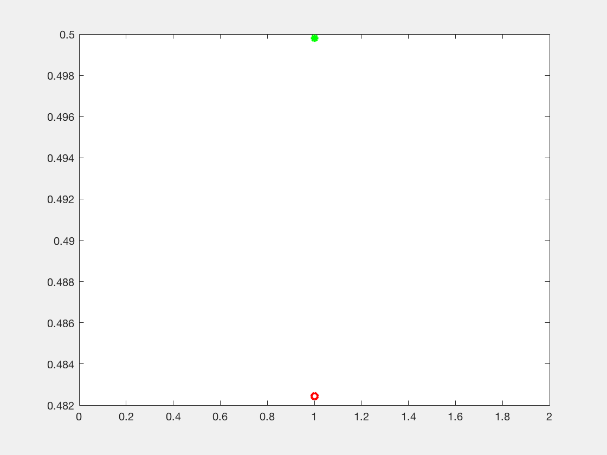
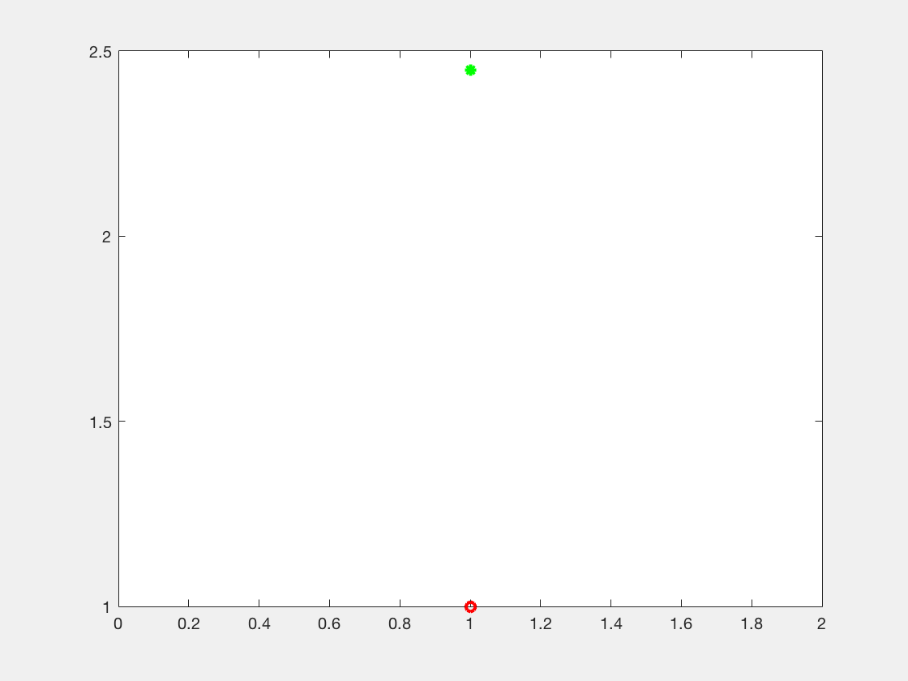
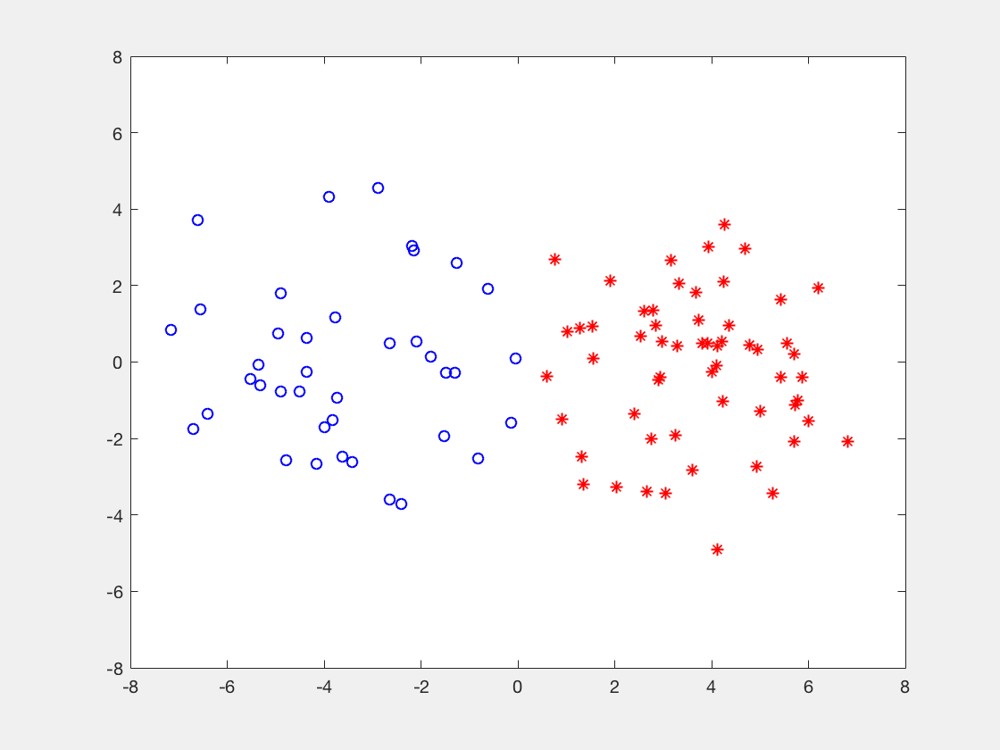

# Minimax Classification under Concept Drift with Multidimensional Adaptation and Performance Guarantees (AMRC)

[](/AMRC_Python) [](/AMRC_Matlab)  [](#support-and-author)

This repository is the official implementation of [Minimax Classification under Concept Drift with Multidimensional Adaptation and Performance Guarantees.](https://arxiv.org/pdf/2205.15942.pdf)

The proposed AMRCs account for multivariate and high-order time changes, provide performance guarantees at specific time instants, and efficiently update classification rules. 

AMRCs provide instantaneous bounds for error probabilities and bounds for accumulated mistakes.

### Instantaneous bounds for error probabilities



### Bounds for accumulated mistakes


## Source code

[](AMRC_Python) 
[](AMRC_Matlab)

AMRC folder contains the Python and Matlab foldes that includes the Python and Matlab scripts, respectively, required to run the code.

### Python code

[Python_code](/Python_code)  folder contains Python scripts required to execute the method:

* run_AMRC.py is the main file. In such file we can modify the values of hyper-parameters such as  , the order, and the feature mapping. In addition, such function tracks uncertainty sets, provides performance guarantees at specific times, and updates classifier parameters.
* efficient_learning.py efficiently updates classifier parameters.
* prediction.py assigns label to instances.
* feture_mapping_function.py calculates feature vectors using linear or random Fourier features (RFF) feature mappings.
* tracking_uncertainty_sets.py contains functions that obtain mean vector estimates and confidence vectors,  update variances of random noises, and initialize mean vector estimates, confidence vectors, and defines matrices and vectors that are used to update mean vector estimates and confidence vectors.
* requeriments.txt contains versions of Python modules


#### Requirements

The requirements are detailed in the requeriments.txt file. Run the following command to install the requeriments:

```setup

AMRC-for-concept-drift/AMRC_Python
pip install -r requirements.txt
```

### Matlab code

[Matlab_code](/Matlab_code) folder contains Matlab scripts required to execute the method:

* run_AMRC.m is the main file. In such file we can modify the values of hyper-parameters such as , the order, and the feature mapping.
* AMRC.m tracks uncertainty sets, provides performance guarantees at specific times, and updates classifier parameters.
* initialize_tau.m initializes mean vector estimates, confidence vectors, and defines matrices and vectors that are used to update mean vector estimates and confidence vectors.
* tracking.m obtains mean vector estimates and confidence vectors.
* feature_vector.m calculates feature vectors using linear or random Fourier features (RFF) feature mappings.
* learning.m efficiently updates classifier parameters.
* predict_label.m assigns label to instances.

## Installation and evaluation

To train and evaluate the model in the paper, run this command for Python:

```console
cd AMRC-for-concept-drift-ICML-2022/AMRC_Python
python run_AMRC.py

```

and for Matlab:

```console
cd AMRC-for-concept-drift-ICML-2022/AMRC_Matlab
matlab run_AMRC.m
```

## Data

We use a synthetic dataset and 13 publicly available datasets.

### Synthetic data




### Real-world datasets

| Dataset | Time Steps | Dimensionality of instances | Number of labels | Majority class | Moving average of one |
|:---------|------------:|---------------------------:|-----------------:|----------------:|------------------------:|
| Weather | 18,159 | 8 | 2 | 68.6 | 32.0  |
| Elec | 1,148 | 4 | 2 | 59.1 | 52.4 |
| Airlines | 539,383 | 7 | 2 | 55.5 | 41.9  |
| German | 1,000 | 24 | 2 | 70.0 | 43.0|
| Chess  | 503| 8 | 2 | 60.6 | 43.4  |
| Usenet 1 | 1,500 | 99 | 2 | 53.3 | 67.0 |
| Usenet 2 | 1,500 | 99 | 2 | 66.7 |  66.6 |
| Email | 1,498 | 913 | 2 | 53.3 | 66.2 |
| C. card | 284,806 | 30 | 2 | 99.8 | 0.33  |
| S. Grid | 60,000 | 13 | 2 | 63.8 | 46.2 |
| Shuttle | 100,001 | 9 | 4 | 35.2 | 64.9   |
| Poker | 829,201 | 10 | 10 | 50.1 | 25.5|

We save the data in .mat files that contain two arrays: X composed by instances and Y composed by labels such as [`usenet2.mat`](Imvt.mat).

## Test case

We display in this reposity an example for the "Usene2" dataset. 

We run the Matlab code

```train
cd AMRC-for-concept-drift-ICML-2022/AMRC_Matlab
matlab run_AMRC.m
```
or Python code

```train
cd AMRC-for-concept-drift-ICML-2022/AMRC_Python
python run_AMRC.py 
```
 and they output:
 
```train
AMRC for order 1 has a mistakes rate 22.5% in "Usenet2" dataset using linear feature mapping
```

We can choose a different dataset and modify parameters values ( , order, and feature mapping) in the main files, that is in run_AMRC.m for Matlab and run_AMRC.py for Python.

## Support and Author

Verónica Álvarez

valvarez@bcamath.org

[](https://github.com/VeronicaAlvarez)

## License 

AMRCs carry a MIT license.

## Citation

If you find useful the code in your research, please include explicit mention of our work in your publication with the following corresponding entry in your bibliography:

<a id="1">[1]</a> 
V. Alvarez, S. Mazuelas, J.A. Lozano.
"Minimax Classification under Concept Drift with Multidimensional Adaptation and Performance Guarantees." In International Conference on Machine Learning. PMLR, 2022.

The corresponding BiBTeX citation is given below:

@InProceedings{AlvMazLoz22,
                    title = 	 {Minimax Classification under Concept Drift with 
                                 Multidimensional Adaptation and Performance Guarantees},
                    author =       {{\'A}lvarez, Ver{\'o}nica and Mazuelas, Santiago and Lozano, Jose A},
                    booktitle = 	 {Proceedings of the 39th International Conference on Machine Learning},
                    pages = 	 {486--499},
                    year = 	 {2022},
                    volume = 	 {162},
                    series = 	 {Proceedings of Machine Learning Research},
                    month = 	 {Jul},
                    publisher =    {PMLR},
                    }
